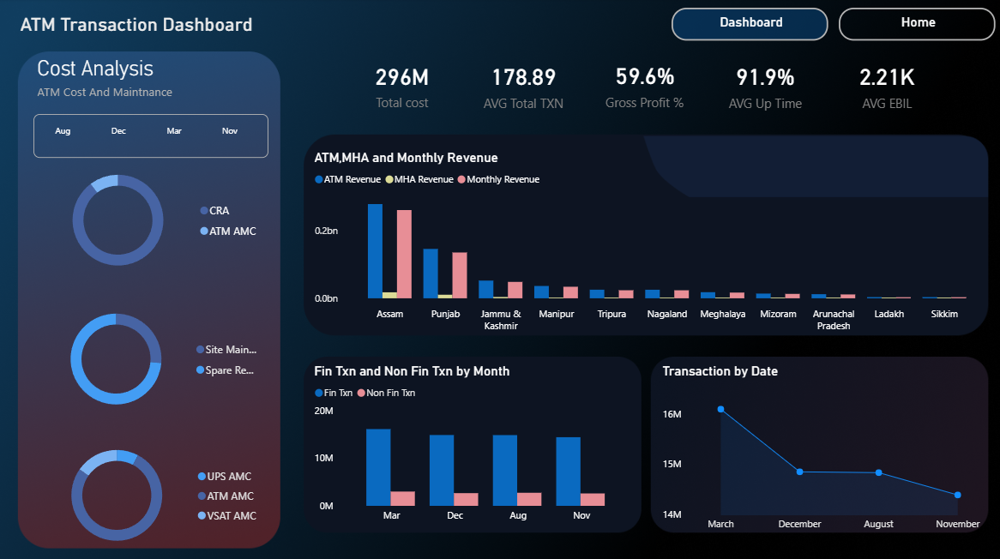

# 🏧 ATM Operational & Financial Performance Dashboard

## 🌟 Overview
This **Power BI dashboard** provides a comprehensive analysis of ATM network operations and financial health. Designed using **Figma** for a modern, high-contrast User Interface (UI), it enables stakeholders to gain deep insights into key metrics, revenue streams, and transaction trends.

## 🛠️ Key Components
The dashboard features four distinct sections to analyze various aspects of ATM performance:

1.  **Financial Indicators:** Evaluates ATM revenue versus monthly revenue, segmented by key regions, highlighting areas of financial growth.
2.  **Operational Metrics:** Monitors financial versus non-financial transaction volumes to compare service usage patterns.
3.  **Cost & Maintenance:** Features a dedicated side panel for cost analysis, including breakdowns for CRA, AMC, Site Maintenance, and Spare Requirements.
4.  **Transaction Trends:** Tracks daily transaction numbers, providing a dynamic look at performance volatility over time.

## 💡 Key Metrics & Insights
The report prominently displays crucial Key Performance Indicators (KPIs) to facilitate quick decision-making:

-   **Gross Profit %:** 59.6%
-   **AVG Up Time:** 91.9%
-   **Total Cost:** 296M
-   **AVG Total TXN:** 178.89
-   **AVG EBIL:** 2.21K

## 🎨 UI/UX Design
-   **Modern UI:** Developed a sophisticated Dark Theme with high-contrast visuals for better readability.
-   **Figma Integration:** Custom-built layout in Figma to ensure a pixel-perfect, professional look.
-   **Interactive Navigation:** Includes a top navigation bar and strategic slicers for a seamless user experience.

## 🚀 Tech Stack
- **Power BI:** Data Modeling, DAX, and Visualization.
- **Figma:** UI/UX Design and Background Assets.
- **Excel/SQL:** Data Source and Structural Preparation.

## 📂 Project Structure
- `workshop.pdix`: The core Power BI project file.
- `2.png`: High-resolution images of the dashboard.

---
© 2026 Abdelrahman Ibrahim. All Rights Reserved.
